# Architecture de "Beer tasting app"

## Descriptions des classes principales

Le back-end du projet est composé de 3 classes principales:

### User

User est la classe qui modélise un utilisateur inscrit à la plateforme et qui peut non seulement voir les différentes dégustations, mais aussi en ajouter. Elle a des méthodes permettant d'enregistrer un nouvel utilisateur dans la base de données et de récupérer les informations du profil de l'utilisateur.

### Tasting

Tasting est le model des dégustations, elle a pour attributs l'ensemble des données permettant de représenter une dégustation en respectant les principes du [BJCP scoresheet](https://www.bjcp.org/exam-certification/program/studying/sample-scoresheets/). Elle comporte aussi les méthodes permettant d'enregistrer une nouvelle dégustation et aussi d'accéder à toutes les dégustations enregistrées sur la plateforme, mais aussi à un ou toutes les dégustations d'un utilisateur (Classe User) en particulier.

### BeerStyle

BeerStyle est la classe qui représente tous les différents styles de bières pouvant être déguster. Elle permet de récupérer les informations enregistrées dans la base de données d'un style de bière selon le [guide de styles BJCP](https://www.brassageamateur.com/wiki/Guide_de_styles_BJCP).

Voir le diagramme UML suivant pour plus de détails.

## Architecture back-end

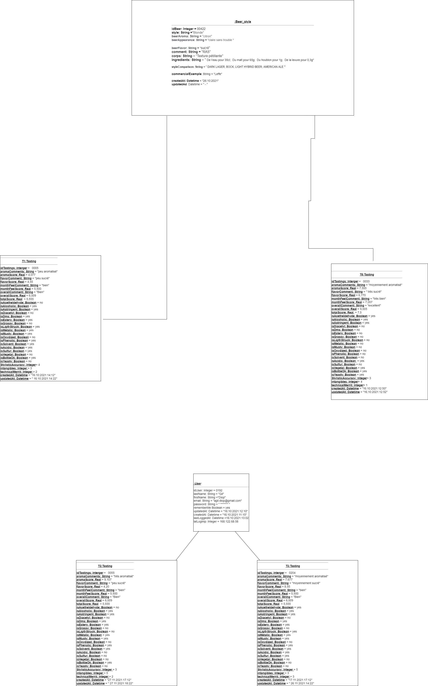

| Diagramme de séquence qui montre le cheminement de l'enregistrement d'une nouvelle dégustation par un utilisateur |
| ----------------------------------------------------------------------------------------------------------------- |

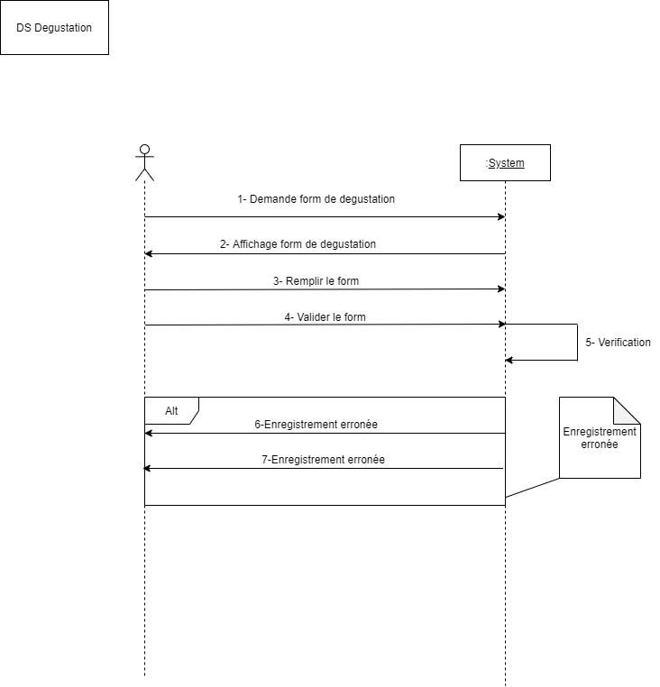

## Architecture de la BDD

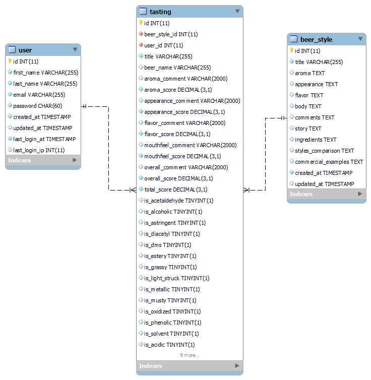

## Architecture du front-end

### Connexion et Inscription

| La vue qui permet de se connecter, sur laquelle est inscrit un lien pour se rendre à la page d'inscription, réinitialiser le mot de passe si besoin | La vue d'inscription permettant de s'inscrire, on y retrouve aussi un lien qui rédirige vers la page de connexion. |
| --------------------------------------------------------------------------------------------------------------------------------------------------- | ------------------------------------------------------------------------------------------------------------------ |
| 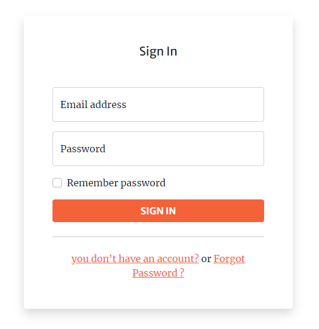                                                                                | 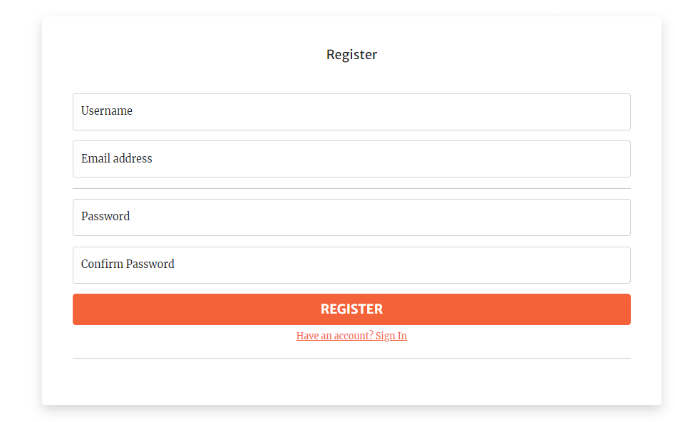                                      |

#### Renitialiser le mot de passe

| Cette vue permet de vérifier que l'utilisateur qui souhaite réinitialiser son de mot de passe, possède un compte. Si oui le ramener vers la page correspondante. | Cette vue permet de réinitialiser le mot de passe.                                         |
| ---------------------------------------------------------------------------------------------------------------------------------------------------------------- | ------------------------------------------------------------------------------------------ |
| 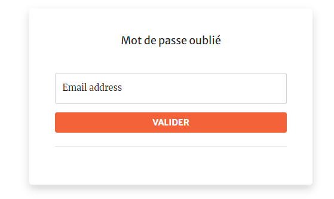                                                                           | 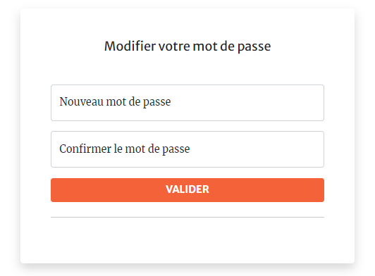 |

### Page d'accueil et Page des dégustations

| Cette vue présente l'interface accessible à l'utilisateur après la connexion. L'utilisateur peut ainsi voir ses anciennes dégustations, voir les dernières dégustations du site, créer de nouvelles dégustations et il peut se déconnecter. | Cette vue présente une liste de dégustations à l'utilisateur. Si l'utilisateur souhaite en savoir plus sur la dégustation, alors il lui suffira de cliquer sur le bouton "SHOW". |
| ------------------------------------------------------------------------------------------------------------------------------------------------------------------------------------------------------------------------------------------- | -------------------------------------------------------------------------------------------------------------------------------------------------------------------------------- |
| 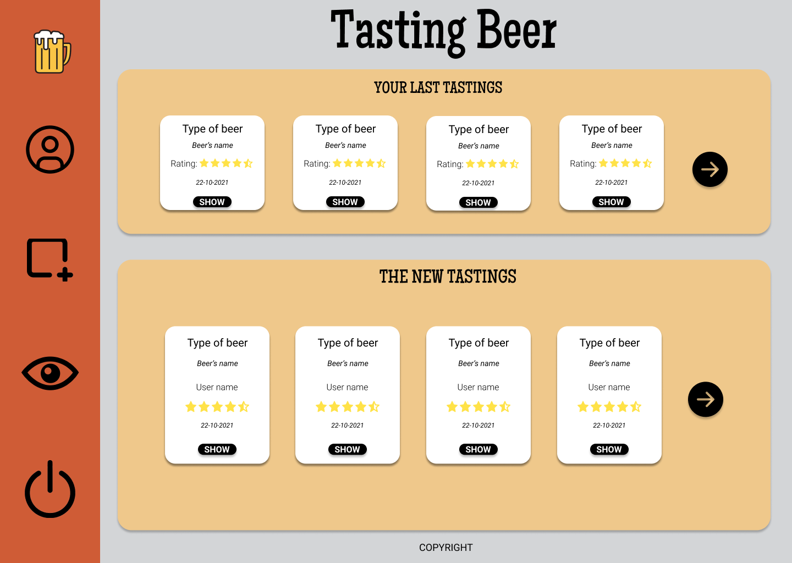                                                                                                                                                                      | 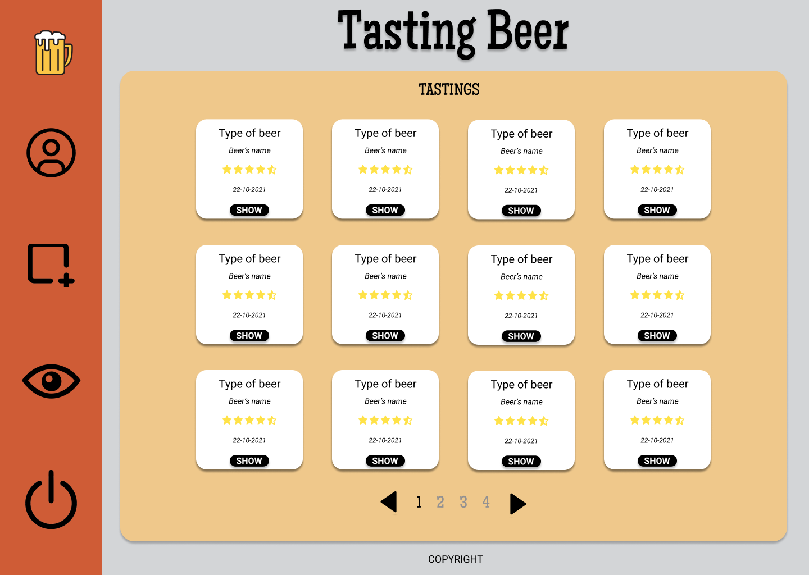                                                                                               |

### Formulaire de dégustation

| Première étape de l'enregistrement d'une nouvelle dégustation. L'utilisateur commence par nommer sa dégustation, indiquer le nom et la catégorie de la bière dégustée. Ensuite, il devra cliquer sur la flèche pour continuer. | Cette vue permet à l'utilisateur d'indiquer ces remarques concernant la bouteille. L'utilisateur peut soit retourner sur la page précédente pour corriger des erreurs, soit passer à la suivante en cliquant sur la flèche adéquate. |
| ------------------------------------------------------------------------------------------------------------------------------------------------------------------------------------------------------------------------------ | ------------------------------------------------------------------------------------------------------------------------------------------------------------------------------------------------------------------------------------ |
| 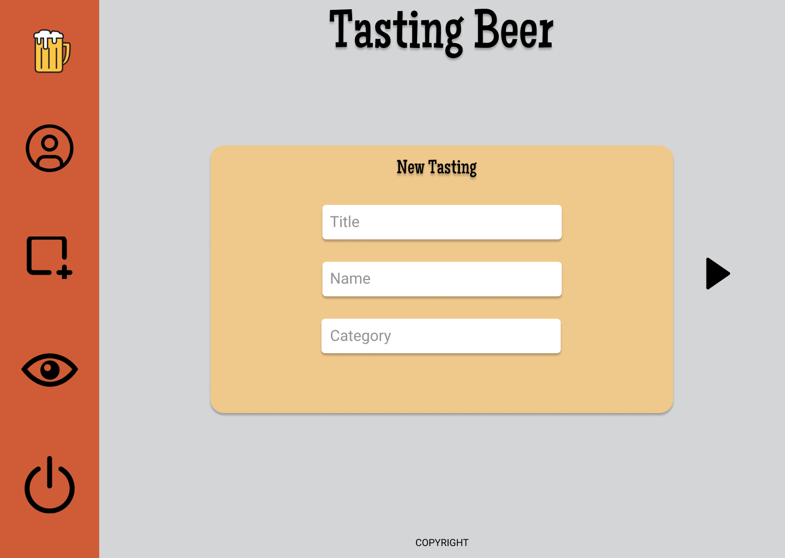                                                                                                                                               | 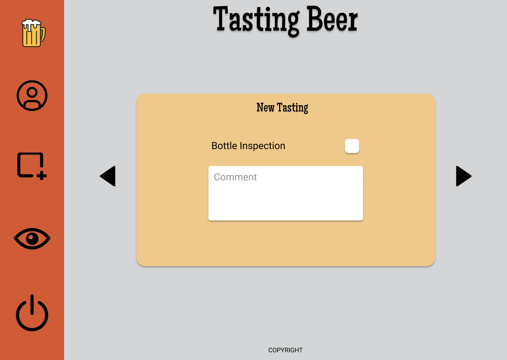                                                                                                                                                  |

### Formulaire de dégustation

| Cette vue permet à l'utilisateur de rentrer les informations de sa dégustation.  | Dernière étape de l'enregistrement d'une nouvelle dégustation.                      |
| -------------------------------------------------------------------------------- | ----------------------------------------------------------------------------------- |
| 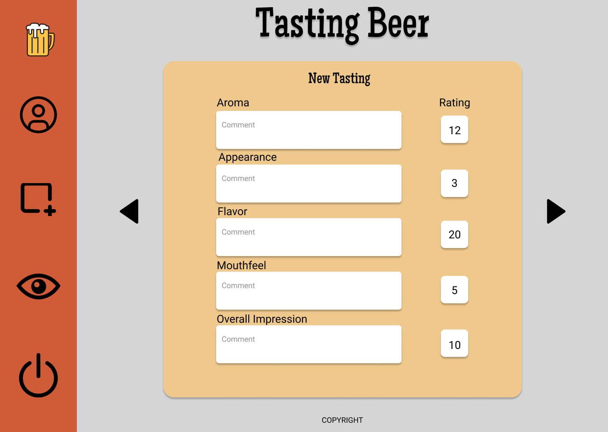 | 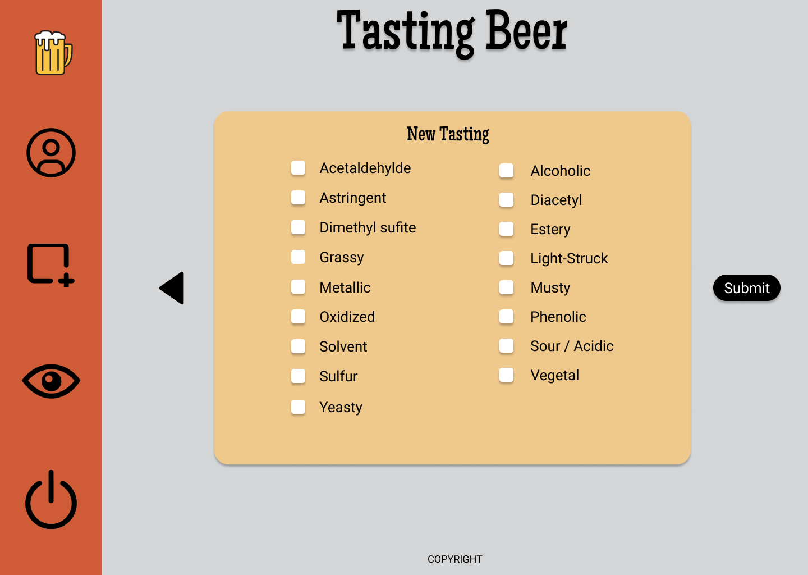 |

### Formulaire de dégustation

| Cette vue indique à l'utilisateur que sa dégustation a bien été enregistrée.     |
| -------------------------------------------------------------------------------- |
| 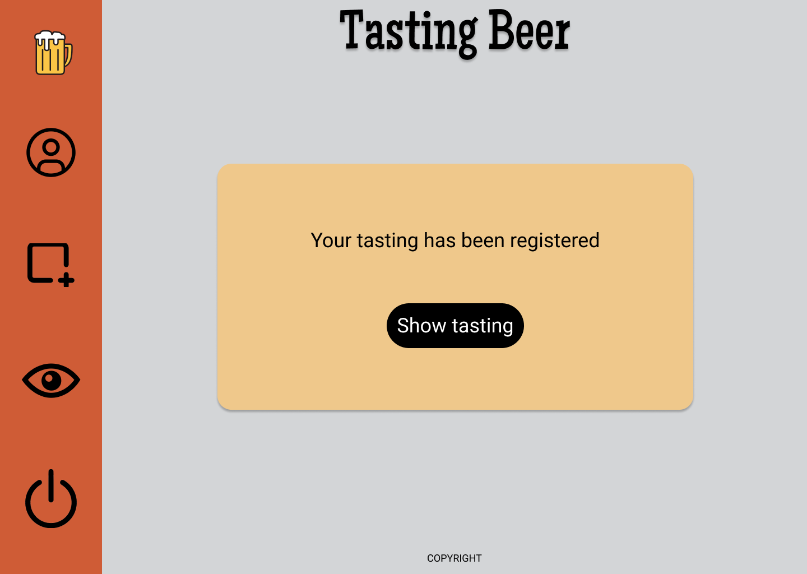 |
|                                                                                  |
